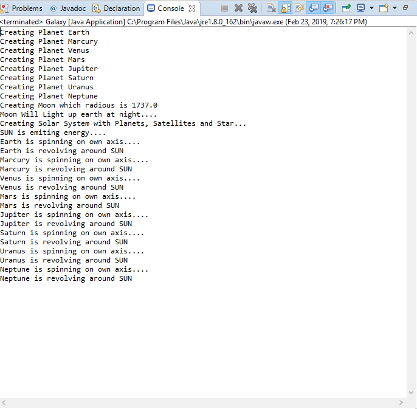

# Creating-Universe-With-OOP-JAVA
Creating Universe With OOP JAVA is a concept and sample of a simple Story solution. From that story this conceptual program is build and this is a demo project for my students for learning purpose. 
.
.
.
# Output

